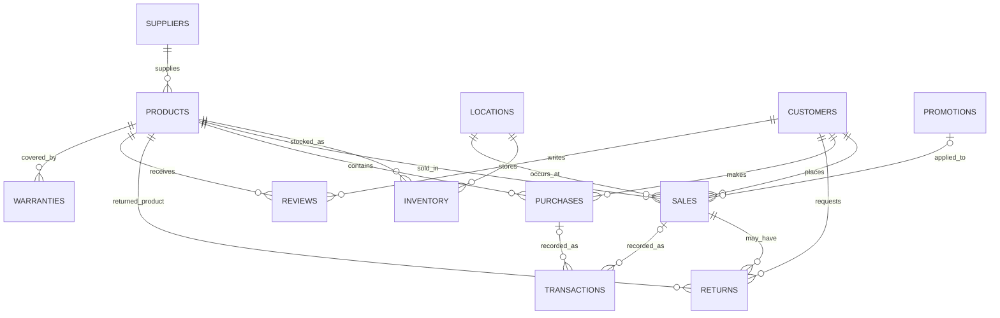

# Electro World Relational Database


A portfolio-ready relational database for **Electro World**, a fictional consumer-electronics retailer. The project demonstrates database modelling, relational integrity, SQL implementation, sample-data design, analytical queries, views, joins, aggregation, subqueries and reproducible MySQL setup.

> **Academic context:** this repository is based on a two-person University of Roehampton Database module project. The portfolio version reorganises and cleans the original work for technical review while keeping the same Electro World business domain.

## Portfolio Highlights

- Designed a relational schema for an electronics retail business.
- Modelled customers, products, suppliers, locations, inventory, sales, purchases, returns, reviews, warranties, promotions and transactions.
- Applied **primary keys, foreign keys, unique constraints, checks and appropriate data types**.
- Added meaningful sample data for every table.
- Demonstrated **INNER JOIN, LEFT JOIN, GROUP BY, ORDER BY, aggregate functions, nested queries, LIKE, IN and BETWEEN**.
- Added reusable database **views** for customer spend, inventory status and product sales.
- Added a MySQL GitHub Actions workflow to verify that the schema, seed data, views and queries execute successfully.

## Skills Demonstrated

| Area | Evidence |
|---|---|
| Relational database design | 12 connected tables with clear entity relationships |
| SQL DDL | `CREATE DATABASE`, `CREATE TABLE`, constraints and relationships |
| SQL DML | Meaningful `INSERT` statements for testing and retrieval |
| Data integrity | PK, FK, UNIQUE, CHECK and NOT NULL constraints |
| Querying | Filtering, sorting, aggregation, joins and subqueries |
| Reporting | Reusable SQL views and analytical queries |
| Database documentation | ERD, data dictionary and design notes |
| DevOps / quality | Automated MySQL CI smoke test |

## Business Problem

Electro World needs a centralised database to manage operational data across its electronics retail workflow. The database supports questions such as:

- Which products generate the most sales revenue?
- Which inventory items are at or below their reorder level?
- Which customers have spent the most?
- Which products are being returned most often?
- What ratings are customers giving products?
- Which promotions are associated with sales activity?
- Which suppliers provide the current product catalogue?
- Which warranties are still active?

## Entity Relationship Overview



See [`docs/ERD.md`](docs/ERD.md) for the fuller model.

## Repository Structure

```text
Electro-World-Relational-Database/
├── .github/workflows/mysql-ci.yml
├── docs/
│   ├── DATA_DICTIONARY.md
│   ├── DESIGN.md
│   ├── ERD.md
│   └── TESTING.md
├── sql/
│   ├── 01_schema.sql
│   ├── 02_seed_data.sql
│   ├── 03_views.sql
│   └── 04_queries.sql
├── .gitignore
└── README.md
```

## Quick Start

**Requirements:** MySQL 8.0+ and a MySQL client such as MySQL Workbench.

```bash
mysql -u root -p < sql/01_schema.sql
mysql -u root -p < sql/02_seed_data.sql
mysql -u root -p < sql/03_views.sql
mysql -u root -p < sql/04_queries.sql
```

## Example Query — Revenue by Product

```sql
SELECT
    p.Name AS Product_Name,
    SUM(s.Quantity_Sold) AS Units_Sold,
    SUM(s.Quantity_Sold * s.Sale_Price) AS Revenue
FROM sales AS s
JOIN products AS p ON p.Product_ID = s.Product_ID
GROUP BY p.Product_ID, p.Name
ORDER BY Revenue DESC;
```

## Database Views

- `vw_inventory_status` — stock quantities and reorder status
- `vw_customer_spend` — spend and purchase count by customer
- `vw_product_sales_summary` — units sold and revenue by product
- `vw_product_review_summary` — average ratings and review counts

## Portfolio Improvements

The original coursework implementation has been reorganised for technical review. The portfolio version uses consistent table naming, strengthens foreign-key relationships, links reviews to products/customers, links products to suppliers, adds optional promotions to sales, introduces domain constraints, and separates schema, data, views and analytical queries into dedicated SQL files.

## Testing

GitHub Actions starts MySQL 8 and automatically runs schema creation, data insertion, view creation, query execution and record-count smoke tests. See [`docs/TESTING.md`](docs/TESTING.md).

## Academic Context

The original module work covered **Business Database Design** and **Business Database Implementation**, including ER modelling, a matching physical data model, table creation, primary/foreign keys, meaningful sample data, filtering, aggregation, grouping, ordering, joins, nested queries and views.

## Author

**Mohamed Ibrahim**  
BEng Software Engineering — University of Roehampton
