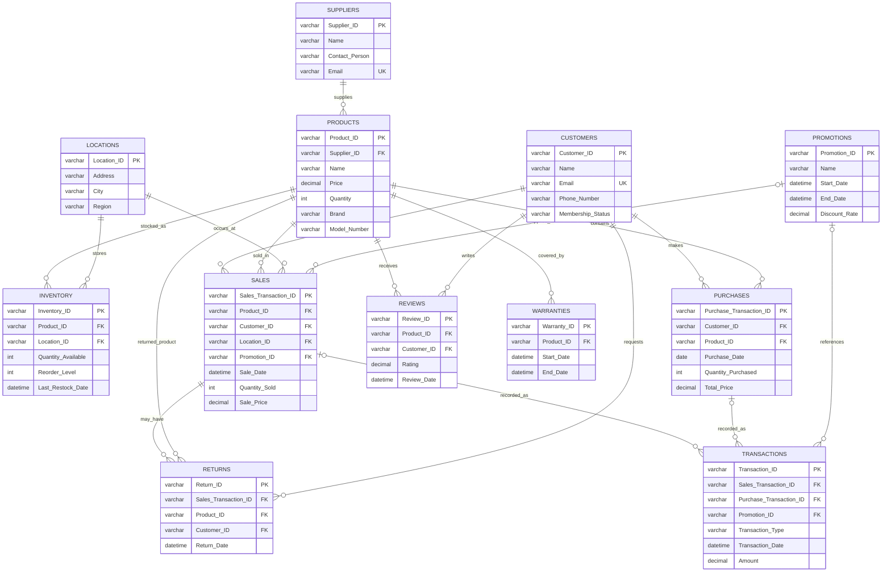

# Entity Relationship Design

The portfolio schema contains **12 principal entity sets**, reflecting the scale of the original database-design coursework.

## Relationship Notes

- A supplier can supply many products; each product has one supplier in this portfolio model.
- A product can be stocked at many locations through inventory records.
- A customer can place many sales and purchase records.
- A sale references one product, one customer and one store location, with an optional promotion.
- Returns point back to the sale that generated them.
- Reviews are linked to both the reviewing customer and reviewed product.
- Warranties are attached to products.
- A transaction records either a sale or a purchase, enforced by a `CHECK` constraint.
